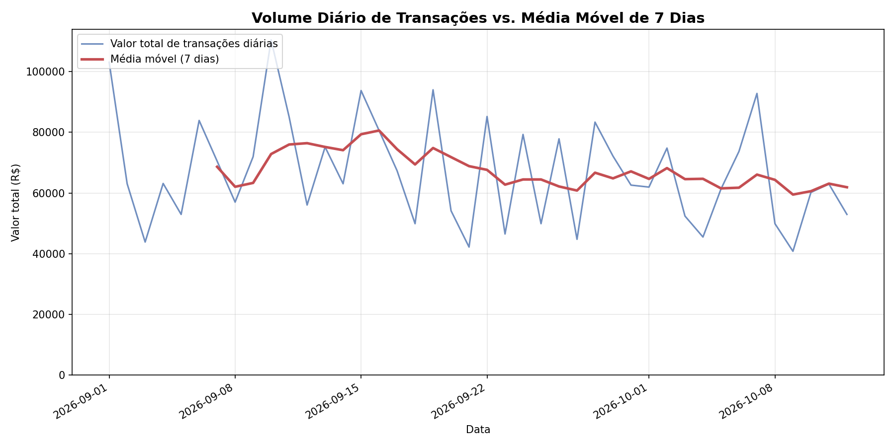

# Pipeline de Consolidação e Detecção de Anomalias — Fintech

Pipeline de Data Science que ingere, limpa, transforma e consolida logs brutos
de **transações financeiras** e **cotações** de uma Fintech, gerando um
relatório com métricas de desempenho, tabela dinâmica de risco, detecção de
anomalias (Z-Score) e um gráfico de série temporal.

## Estrutura do repositório

```
fintech-pipeline/
├── generate_data.py     # gera os dados brutos (transacoes.csv e cotacoes.csv)
├── pipeline.py           # pipeline completo de ETL + análise + relatório
├── requirements.txt
├── outputs/
│   └── grafico_transacoes_diarias.png   # exemplo do gráfico gerado
└── README.md
```

Os arquivos `transacoes.csv` e `cotacoes.csv`, assim como os demais `.csv` de
`outputs/`, **não são versionados** (ver `.gitignore`) — eles são recriados a
cada execução, garantindo que o pipeline seja reprodutível a partir do
código-fonte.

## Como executar

```bash
# 1. Criar ambiente e instalar dependências
python -m venv .venv
source .venv/bin/activate        # Windows: .venv\Scripts\activate
pip install -r requirements.txt

# 2. Gerar os dados brutos de log (fornecido pela Engenharia)
python generate_data.py

# 3. Executar o pipeline completo
python pipeline.py
```

Ao final, a pasta `outputs/` conterá:

| Arquivo | Descrição |
|---|---|
| `transacoes_limpas.csv` | base tratada, deduplicada e enriquecida |
| `pivot_risco_mes.csv` | tabela dinâmica: mês x nível de risco (com subtotais) |
| `anomalias_zscore.csv` | transações com Z-Score > 2.5 por estado |
| `transacoes_suspeitas_setembro.csv` | filtro bitwise (set / SP-RJ / valor > 5000) |
| `consolidado_diario_cotacao.csv` | volume diário de transações cruzado com a cotação do dia |
| `grafico_transacoes_diarias.png` | valor diário vs. média móvel de 7 dias |

## Etapas do pipeline (`pipeline.py`)

**1. Ingestão, performance e limpeza**
- Leitura de `transacoes.csv` com `encoding='latin1'` (evita corrupção de
  caracteres do log legado).
- Imputação de `valor` ausente pela **mediana por estado**, via
  `groupby('estado_cliente')['valor'].transform('median')` — totalmente
  vetorizado, sem laços.
- Criação da coluna estática `plataforma = 'Mobile'` para rastreabilidade.

**2. Engenharia de dados & alinhamento temporal**
- Conversão de `data_transacao` para `datetime64[ns]` e aplicação do fuso
  `America/Sao_Paulo` com `.dt.tz_localize`.
- Extração de `dia_semana` e `mes` via acessor `.dt`.
- Remoção de duplicatas com `drop_duplicates(keep='first')`.

**3. Operações vetorizadas e filtros bitwise**
- Filtro de transações de setembro em `SP`/`RJ` com valor > R$ 5.000,00
  usando **exclusivamente operadores bitwise vetorizados** (`&`, `|`),
  sem `and`/`or` escalares nem laços `for`.

**4. Cruzamento de dados & agregação**
- Atribuição do nível de risco por cliente via `Series.map(risco_dict)`.
- `pivot_table` por `mes` (linhas) x `nivel_risco` (colunas), somando
  `valor`, com `margins=True` para subtotais.

**5. Detecção estatística de outliers (Z-Score)**
- Z-Score calculado por estado de forma vetorizada:
  `(valor - média_do_estado) / desvio_padrão_do_estado`, usando
  `groupby(...).transform(...)` (sem `for`).
- Anomalias = registros com `Z > 2.5`.

**6. Visualização (Matplotlib OO)**
- Gráfico construído com a API orientada a objetos (`fig, ax = plt.subplots()`),
  plotando o valor total diário e a média móvel de 7 dias
  (`.rolling(7).mean()`), eixo Y iniciando em zero (`ax.set_ylim(bottom=0)`),
  título e legendas.

**Extra — consolidação com `cotacoes.csv`**
- O segundo log (cotações da empresa) é limpo (interpolação linear dos
  poucos valores ausentes) e cruzado com o volume diário de transações,
  gerando o valor transacionado também em USD — atendendo ao pedido de
  "consolidar os dados" dos dois arquivos de log.

## Exemplo do gráfico gerado



## Requisitos

- Python 3.9+
- pandas, numpy, matplotlib (ver `requirements.txt`)
